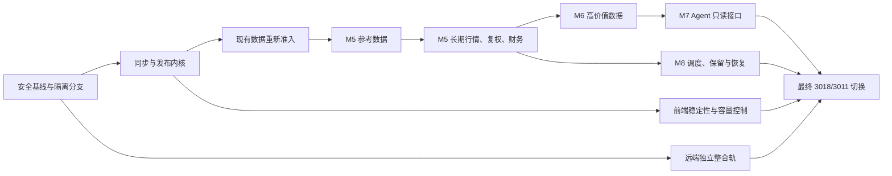

# one-trading 数据工作台 M5–M8 收尾实施计划

> **执行要求：** 实施时使用隔离 worktree、测试驱动、逐任务提交和独立复核。正式计划保存为 `docs/superpowers/plans/2026-07-21-data-platform-m5-m8-closeout.md`。

## 一、目标与最终完成标准

在保留现有 Parquet、DuckDB、SQLite 控制面和前端页面的前提下，把当前“目录基础已建、部分数据仍不可解释”的状态完善为：

- 页面普通加载只读取本地 API，不因外部数据源卡住。
- 每个数据集明确区分 `unavailable / lab / canary / production / retired`。
- 所有生产数据都有 schema、单位、来源、时间语义、质量和 lineage。
- 交易日历、上市退市、停复牌成为正式参考数据。
- 股票、ETF、指数日线扩展至来源允许的完整历史。
- 复权、公司行动、全 A 点时态财务形成闭环。
- 完成 M6 的估值、事件、股东、指数和 ETF 高价值数据。
- 为 AI Agent 提供受控只读接口，不开放任意 SQL。
- 数据目录目标维持在 28–30GB，硬上限 40GB。
- 远端分歧在独立整合轨处理，最终版本切换到本机 3018/3011。
- 不建设全 A 长期分钟、逐笔、五档历史库，不接入不透明数据包。

当前基线：

- `main` HEAD：`56d4810`，相对远端 ahead 51 / behind 207。
- 数据目录约 186MB、5,868 个文件、24 个目录数据集。
- `trading_calendar` 已发布，但截止 `2026-07-21`，尚未自动维护。
- 股票日线约 139 万行，只覆盖约一年。
- 财务约覆盖 1,900 个标的；股本表主要是当前截面。
- 多个正式数据集仍为 `quality=unknown`，指数数据为 `failed`。
- `listing_delisting_events` 和 `instrument_status_history` 仍是影子样本。
- 当前 3011/3018 未运行。



## 二、架构和公共接口

### 2.1 保持现有三层

- **数据平面：** Parquet 继续保存正式数据，不迁入 SQLite。
- **查询平面：** DuckDB/Polars 读取正式 Parquet；不保存第二份行情。
- **控制平面：** SQLite 保存目录状态、任务、产物、检查点、来源健康和容量策略。
- **界面层：** React Query 只访问本地 API；外部访问必须由显式同步任务触发。
- **Agent 层：** 只消费受控数据接口，不连接外部 Provider、不执行客户端 SQL。

### 2.2 新增同步模块

新增 `backend/app/data_sync/`，职责固定为：

- `models.py`：同步请求、发布结果、质量报告、检查点模型。
- `publish.py`：从现有 `data_lab.publish_protocol` 提炼生产发布协议。
- `registry.py`：`dataset_id → sync handler` 白名单。
- `service.py`：任务编排、容量预检、租约、取消、恢复和 catalog 刷新。
- `sources/`：每个正式数据源的 one-trading 自有适配器。

`backend/app/data_lab/` 保留 Source Lab、fixture、对照报告；生产运行不得直接调用 Lab runner。

### 2.3 SQLite 迁移

新增后续迁移，不修改或重建现有 `001_init.sql`：

- `dataset_policies`
  - 数据阶段、最大允许延迟、同步计划、来源策略、保留策略。
- `sync_checkpoints`
  - 数据集、scope、分页 cursor、watermark、最近成功 run。
- `dataset_leases`
  - 防止调度器、手动操作或第二进程同时写同一数据集。
- `retention_plans`
  - 清理建议、文件 manifest、预计释放空间、过期时间。
- `agent_query_audit`
  - 只记录数据集、数量、耗时和状态，不保存 prompt 或返回数据。

数据库继续使用 WAL、`foreign_keys=ON`、`busy_timeout=5000`。

### 2.4 数据目录类型扩展

为 `DatasetCatalogEntry` 增加兼容字段：

```text
phase:
  unavailable | lab | canary | production | retired

freshness:
  status: fresh | stale | expired | unknown
  data_through
  expected_through
  lag_trading_days
  checked_at
  reason_code

sync_policy:
  mode: manual | scheduled
  next_run_at
  active_job_id
  supports_backfill
  supports_repair

quality_issues:
  code
  severity
  count
  message
```

`CatalogResponse` 增加容量摘要：

```text
capacity:
  used_bytes
  projected_peak_bytes
  soft_limit_bytes
  write_block_bytes
  hard_limit_bytes
  state: normal | warning | blocked | exceeded
```

保留现有 `/api/data/status`、`/api/pipeline/*` 和目录 API 响应字段，不破坏 Dashboard、选股、回测等消费者。

### 2.5 新同步 API

```text
POST /api/data/sync
GET  /api/data/sync/{job_id}
POST /api/data/sync/{job_id}/cancel
GET  /api/data/storage
POST /api/data/retention/preview
```

同步请求：

```json
{
  "dataset_id": "trading_calendar",
  "mode": "incremental",
  "start": null,
  "end": null,
  "symbols": null,
  "dry_run": false,
  "idempotency_key": null
}
```

约束：

- `mode` 仅允许 `incremental / backfill / repair`。
- 同一数据集只能有一个写任务。
- `repair` 必须携带已完成的备份标识。
- 重复 `idempotency_key` 返回原任务。
- 取消只在分页或分区边界生效。
- 达到容量阻断线时拒绝新的 backfill。
- 页面 GET、catalog rescan 和 Agent 查询绝不访问外网。

本轮只生成清理建议，不实现后台自动删除。

## 三、详细实施任务

## 阶段 A：安全基线与执行隔离

### Task A1：冻结当前基线

- [ ] 记录当前 HEAD、分支、远端分歧和工作树状态。
- [ ] 保存 24 个数据集的行数、日期、质量、空间和来源摘要。
- [ ] 保存 `data/` 全文件大小与 SHA-256 manifest。
- [ ] 保存当前 SQLite schema、`integrity_check` 和表行数。
- [ ] 保存后端、前端测试及构建结果。
- [ ] 保留用户的 `output/`，不得纳入提交或清理。

验收：检查前后 Git 和正式数据指纹一致。

### Task A2：建立完整备份

备份目录：

```text
/Users/simon/备份/codex/<timestamp>-one-trading-m5-m8-closeout-baseline/
```

备份必须包含：

- 代码差异和 Git 信息。
- 完整 `data/`；当前只有约 186MB，直接全量备份。
- SQLite、lineage、job store、用户配置和日志 manifest。
- `README.md`，写明原因、原始绝对路径、时间和恢复方法。
- 源数据与备份逐文件 hash 验证结果。

### Task A3：建立两条隔离开发轨

- 数据改造分支：`codex/data-platform-closeout-m5-m8-20260721`。
- 远端整合分支：`integrate/origin-main-20260721`。
- 两者都从当前本地 HEAD 创建独立 worktree。
- 正式 `main` 和真实 `data/` 不作为日常实现工作区。
- 数据测试使用备份副本或临时 `DATA_DIR`。

### Task A4：建立阶段验收报告模板

每批必须分别报告：

- 代码是否实现。
- 自动测试是否通过。
- 隔离数据是否通过。
- 正式数据是否写入。
- 真实页面是否验证。
- 是否已切换运行面。
- 是否可以回滚。

## 阶段 B：同步、发布和恢复基础

### Task B1：升级参考数据 schema

在另外两张参考表正式发布前升级到点时态 schema。

`listing_delisting_events`：

```text
symbol, event_type, event_date, name, exchange, prior_symbol,
source_record_id, source_published_at, first_seen_at, source, as_of
```

`instrument_status_history`：

```text
symbol, status, effective_from, effective_to, reason,
source_record_id, source_published_at, first_seen_at, source, as_of
```

规则：

- 不接受 `1970-01-01` 哨兵日期。
- 时间区间不得倒置或重叠。
- 同一来源记录必须具有稳定 `source_record_id`。
- 修订记录更新 `first_seen_at`，不能覆盖历史事实。
- 缺失 K 线不能自动生成停牌状态。

### Task B2：生产化发布协议

将 Lab 协议升级为正式发布内核：

1. 获取数据集租约。
2. 计算任务预计峰值空间。
3. 写入 `data/.staging/<dataset_id>/<run_id>/`。
4. 标准化字段与单位。
5. 主键去重。
6. 执行 dataset-specific 质量检查。
7. 与现有正式数据做重叠比较。
8. 原子写入单文件或单日期分区。
9. 写完整 lineage。
10. 在一个 SQLite 事务中登记 run、artifact、checkpoint。
11. 刷新对应 catalog 数据集和 DuckDB/Polars 缓存。
12. 成功后清理 staging；失败保留报告和上一份健康数据。

lineage 必须包含：

```text
run_id, dataset_id, source, endpoint_family, fetched_at,
source_published_at, schema_version, unit_version, quality_status,
scope, row_count, artifact_path, sha256
```

### Task B3：限制历史回填覆盖行为

- 默认 `backfill` 只增加缺失的旧日期分区。
- 已存在且健康的分区只比较、不覆盖。
- 发现差异时进入审核清单。
- 只有 `repair` 模式可替换旧分区。
- `repair` 前备份受影响分区、lineage 和 SQLite。
- 每个日期分区继续使用 `date=YYYY-MM-DD/part.parquet`，不建立第二套日线主表。

### Task B4：统一同步任务编排

- 复用现有 `JobStore` 展示即时进度。
- 新任务同步镜像到 SQLite `sync_runs`。
- 全局只运行一个大型历史任务；实时 quote snapshot 不受阻。
- 同一数据集使用 SQLite lease 防止第二进程重复写。
- 卡死任务启动时转为 `failed/orphaned`，不得永久显示 running。
- 任务取消在安全边界退出，并保留 checkpoint。

### Task B5：实现检查点和断点续传

- 日线按市场、标的批次和日期窗口保存 cursor。
- 财务按表、报告期和 symbol 批次保存 cursor。
- 事件数据按 source page/token 和公告日期保存 cursor。
- 任务重启只继续缺失 batch。
- 已发布 artifact 根据 hash 跳过。
- 同一请求重复执行不能产生重复行或重复事件。

### Task B6：启动恢复与失败注入

必须覆盖：

- 抓取超时。
- HTTP 200 但空结果。
- 字段漂移。
- 单位未知。
- SQLite 锁等待。
- 磁盘空间不足。
- Parquet 已发布但 SQLite 尚未登记时进程退出。
- lineage 已写但 catalog 刷新失败。
- 第二进程竞争同一数据集。
- 重启后 orphaned staging 和任务恢复。

## 阶段 C：现有 24 个数据集重新准入

### Task C1：修复 catalog 事实错误

重点处理：

- `sealed_l1` epoch 时间被显示成字符串日期的问题。
- `stock_daily` 标的数大于当前 instruments 的原因。
- `financial_shares` 标的数大于当前 instruments 的原因。
- `index_daily/index_enriched` 598/612 导致失败的真实缺口。
- ETF 日线 1,588/1,643 的未覆盖原因。
- 旧 lineage 缺少 `quality_status` 和 unit evidence。

### Task C2：建立旧数据重新准入工具

逐个正式数据集执行：

- schema 和 dtype 检查。
- 主键唯一性。
- 日期范围。
- 单位合理性。
- 分区 hash。
- 当前 Provider、历史 job 和 lineage 的来源关联。
- 沪深北覆盖。
- 质量报告落盘。

判定规则：

- 来源和单位都可追溯：允许 `healthy`。
- 数据结构正确但历史来源不足：标记 `degraded/legacy_source_unverified`。
- schema 或单位不可信：保持 `unknown` 或 `failed`。
- 禁止仅因为文件可读就补写“健康”lineage。

### Task C3：修正覆盖率分母

现有覆盖率不能只以“当前 instruments 总数”为分母。

新的 `expected universe as-of`：

- 上市日期不晚于目标交易日。
- 尚未退市。
- 当日不处于停牌区间。
- 资产类型与市场匹配。
- 历史代码变更按当时 symbol 计算。

在生命周期数据尚未生产前，覆盖率明确标记 `denominator_provisional=true`。

### Task C4：完成当前质量债收口

验收要求：

- 每个 production 数据集不再无解释地显示 `unknown`。
- `failed` 必须附带具体 issue 和数量。
- `depth5` 继续明确不可用。
- 旧数据不得被重新准入工具修改内容，只补报告和可信元数据。
- 数据工作台能区分“可查询但来源待核验”和“不可服务”。

## 阶段 D：M5 第一批参考数据闭环

### Task D1：交易日历正式同步服务

- 主源：现有深交所 monthList 适配器。
- 二次校验：腾讯 SH/SZ 指数开市日，只作为代理验证源。
- 正式 lineage 明确说明 SH/SZ/BJ 行由同一现金市场日历假设扩展，不冒充三套官方源。
- 每次增量获取上月、当月和下月；与现有行 merge。
- 既有 `is_open` 翻转默认拒绝，进入 repair 审核。
- 当前日期没有覆盖时为 stale；未来月份暂未发布只作为提示。
- 空响应、网络错误或交叉源分歧不覆盖旧日历。

### Task D2：日历调度和工作台操作

- 启动时检查日历是否覆盖当前日期。
- 每个交易日 08:20 做轻量 freshness check，仅在 stale 时拉取。
- 提供手动“同步交易日历”按钮。
- 展示最后成功、覆盖截止、下一次计划和来源状态。
- 页面首次加载及刷新只读取 SQLite/catalog。

### Task D3：上市、退市与代码变更 Source Lab

候选顺序固定为：

1. 上交所、深交所、北交所公开证券列表和退市公告。
2. AKShare、BaoStock、easy_tdx 仅作接口和字段交叉核验。
3. 当前 instruments 快照只作覆盖率 seed，不能当正式历史源。

Lab 必须覆盖：

- SH、SZ、BJ。
- 当前上市、已退市、重新上市和代码变更样本。
- 至少一个退市标的、一个代码变化标的、一个北交所标的。
- 来源权利、历史分页、空结果语义和更新时间。
- 当前 5,529 个 instruments 的映射率。
- 退市证券不能因不在当前列表中被遗漏。

若任一市场无法取得可准入历史，该数据集保持 Lab，不发布跨市场 production 状态。

### Task D4：生命周期生产发布

Source Lab 通过后：

- 先发布 canary：每市场 20 个当前标的和全部已找到退市样本。
- 比较 instruments、日线最早日期和来源事件。
- 通过后发布完整事件表。
- 注册到 catalog 的“参考数据”分组。
- 生成当前 universe 和任意 `as_of` universe 的只读服务。

### Task D5：停复牌与证券状态 Source Lab

候选顺序：

1. 三家交易所停复牌公告或状态数据。
2. 东财/AKShare 等只作交叉验证。
3. 不使用“当日分区缺少 symbol”推导停牌。

必须验证：

- suspension、resume、ST、*ST、delisted 的时间语义。
- 公告时间和生效日期分离。
- 区间不重叠。
- 临时停牌和长期停牌。
- 至少覆盖最近五年，随后与日线历史范围逐步对齐。

### Task D6：状态历史生产发布

- 先发布 shadow/canary，不影响现有业务。
- 与缺失 K 线、零 OHLC heuristic 和公告样本对照。
- 生产后注册目录。
- 旧 heuristic 仅保留为质量告警，不能成为正式状态源。

### Task D7：接入业务消费者

新增本地 `TradingCalendarService` 和 `InstrumentLifecycleService`：

- 回测交易日期优先使用正式日历。
- 日线覆盖率使用 as-of universe 和停牌状态。
- 退市股票仍能进行历史查询。
- `filter_halt_days` 只负责剔除无效 bar，不负责认定停牌。
- 日历不可用时可以临时回退到“数据中实际存在的日期”，但结果必须带 `calendar_fallback=true`。
- 不允许静默回退到简单周一至周五。

## 阶段 E：M5 长期行情、复权和财务

### Task E1：长期日线来源准入

数据源优先级：

1. 已配置并验证权限的 TickFlow。
2. 通过 Source Lab 的 TDX/BaoStock/公开来源。
3. 其他 GitHub 项目只借接口和工程机制。

明确排除：

- `free-stockdb` 不透明数据库。
- Wind 强依赖的 `a-share-kline-puller` 运行时。
- 未获许可的 Sina Static KLC。
- 把复权价格当作独立复权因子。

Canary 样本：

- 每市场不少于 10 个高流动性标的。
- 科创板、创业板、北交所。
- 已退市和长期停牌样本。
- ETF 和指数各不少于 10 个。
- 至少覆盖一个拆股/分红事件区间。

### Task E2：股票长期日线回填

- 使用现有 `kline_daily/date=...`。
- 从最早可用历史向当前数据前一天回填。
- 每批最多一个自然月或 500 个 symbol。
- 每批通过后才推进 checkpoint。
- 现有约一年数据只比较，不默认重写。

健康门槛：

- 主键唯一率 100%。
- OHLC 关系 100% 合法。
- 成交量单位为手、成交额为人民币元。
- 每市场覆盖率不低于 99.5%；97%–99.5% 为 degraded；低于 97% 为 failed。
- 任何市场预期标的非零但实际为零时直接 failed。
- 重叠价格差异超过一个合理 tick 的记录进入审核。

### Task E3：ETF 和指数长期日线

- ETF 回填至成立以来。
- 指数回填至发布日期以来。
- 使用现有 ETF/指数主路径。
- 指数 expected universe 不再简单等于全部指数 instruments；对无历史行情的说明型指数分类排除。
- 不因 14 个无 bar 指数让整个指数数据集永久 failed。

### Task E4：增量日线维护

- 盘后任务继续使用现有 scheduler。
- 先查正式交易日历，再决定是否应同步。
- 先计算 as-of expected universe，再判断覆盖。
- 日线、enriched、质量报告、catalog 更新按顺序完成。
- enriched 只有在基础日线健康或 degraded 可接受时计算。
- 部分市场失败时不得显示全市场成功。

### Task E5：复权因子与公司行动

建立 `corporate_actions`：

```text
symbol, action_id, action_type, announce_date, record_date,
ex_date, pay_date, cash_per_share, stock_ratio, rights_ratio,
currency, source_published_at, first_seen_at, source
```

实施顺序：

1. 扩展股票复权因子至全 A。
2. 增加 ETF 复权。
3. 从公司行动源构建事件表。
4. 公司行动与复权因子双向核对。
5. 为每个 symbol 标记：
   - verified_events
   - verified_no_event
   - source_failed
   - unverified
6. 不得把“没有抓到”当作“没有分红送转”。

### Task E6：全 A 点时态财务

保留五张表：

- metrics
- income
- balance_sheet
- cash_flow
- shares

统一增加：

```text
report_date, announce_date, update_date, period_type,
currency, amount_scale, source, fetched_at, first_seen_at,
restatement_id
```

规则：

- 全表在 staging 合并后原子替换。
- 当前约 1,900 个标的逐批扩展至来源完整集合。
- 退市公司不从 universe 中剔除。
- `shares` 从当前截面升级为带 `effective_date` 的历史序列。
- 同一报告期修订保留 restatement，不直接覆盖。
- `as_of` 查询只允许 `announce_date <= as_of`。

### Task E7：M5 统一验收

M5 退出条件：

- 三张参考数据均有明确生产或 No-Go 状态。
- 日历自动维护且覆盖当前日期。
- 长期日线可断点续传、重复执行无重复。
- 全 A 日线不存在系统性沪深北缺口。
- 复权与公司行动可互相解释。
- 财务支持 point-in-time 查询。
- 旧页面/API 消费者不需要更换主接口。
- 当前健康数据未被部分结果覆盖。

## 阶段 F：M6 高价值数据

每个数据集统一执行：

1. 更新 GitHub 借鉴总账和数据能力目录。
2. 固定候选项目 commit 和真实数据生产者。
3. 核查生产使用、缓存和长期保存权利。
4. 隔离 Source Lab。
5. canonical schema 与点时态规则。
6. fixture 单测和 live 小样。
7. shadow。
8. canary。
9. production。
10. catalog、前端和消费者接入。

### Task F1：日频估值 `valuation_daily`

字段：

```text
symbol, trade_date, pe_ttm, pb, ps_ttm, pcf_ttm,
total_mv, float_mv, total_share, float_share,
source, fetched_at
```

优先情报：astock-data-toolkit、myhhub、a-stock-data、AKShare。

质量重点：

- 市值和股本统一为元/股。
- 亏损 PE 不强制正数。
- 不用 F10 当前快照冒充历史。
- 与 shares、close 交叉核验市值。

### Task F2：涨停事件 `limit_up_events`

字段：

```text
symbol, trade_date, state, first_seal, last_seal,
break_count, seal_fund, board_height, reason,
source_published_at, first_seen_at, source
```

区分盘中状态和盘后最终状态；原因文本与原始事实分层保存。

### Task F3：龙虎榜、席位和大宗交易

数据集：

- `dragon_tiger`
- `dragon_tiger_seats`
- `block_trades`

重点处理：

- 重复上榜原因。
- 买卖席位方向。
- 机构名称规范化。
- 空明细是无数据还是请求失败。
- 折溢价、成交量和成交额单位。

### Task F4：股东和治理事件

数据集：

- `ownership_events`
- `governance_events`

覆盖：

- 股东户数。
- 十大股东。
- 增减持。
- 股权质押。
- 回购、担保、诉讼等治理事件。

全部保存报告期、公告时间、首次看到时间和修订。

### Task F5：指数关系数据

数据集：

- `index_membership_history`
- `index_weights`

规则：

- 成分关系使用 `effective_from/effective_to`。
- 权重带 trade_date。
- 回测只能读取当时生效版本。
- 当前 `pools` 快照不能冒充历史成分。

### Task F6：ETF 数据

数据集：

- `etf_nav`
- `etf_holdings`

区分：

- ETF 每日净值。
- ETF 成分/申赎清单。
- 公募基金季度持仓。

不得把三种口径混成一张表。

### Task F7：M6 目录和产品接入

- 新数据按估值、市场事件、所有权、指数关系、ETF 分组展示。
- Lab 数据不显示“可服务”。
- 每个数据集显示来源、披露滞后、最新日期和点时态能力。
- 选股和回测只接入已 production 且健康的数据集。

M6 收尾条件：

- 12 个计划数据集都有 production 或有证据的 No-Go。
- `valuation_daily`、`corporate_actions`、`limit_up_events`、`index_membership_history` 必须至少完成 production，才能称为高价值数据第一版完成。

## 阶段 G：前端稳定性和性能

### Task G1：数据工作台本地优先状态模型

四个区域继续保留：

1. 数据系统状态。
2. 数据集目录。
3. 同步和维护操作。
4. 同步历史与质量问题。

新增顶部状态条：

- SQLite 是否可用。
- catalog 更新时间。
- 本地数据是否 stale。
- 当前任务。
- 已用空间和阈值。
- 最近失败来源。

### Task G2：精确 React Query 失效

- 同步完成只失效目标 dataset、runs 和必要消费者。
- 禁止用字符串 `startsWith` 广泛清空查询。
- catalog 总表只在状态发生变化时失效。
- 错误时保留 last-known-good 数据。
- 当前 drawer 打开时只刷新对应 schema/runs。
- 任务进度继续使用现有短轮询；不为数据任务另建行情 SSE 通道。

### Task G3：失败隔离和错误边界

- 四个页面区域分别包 Error Boundary。
- catalog 失败不能让同步操作区或历史区白屏。
- storage 失败显示“容量未知”，不能显示 0。
- 外部源失败只影响当前同步任务。
- stale 数据继续可见，并明确标注更新时间。
- 空目录与 API 错误使用不同文案。

### Task G4：前端包体拆分

- 路由页面改为 `React.lazy`。
- ECharts、回测和 AI 页面按路由加载。
- `/data` 不加载无关图表和 AI 模块。
- 初始 gzip JS 目标低于 450KB。
- 除独立 ECharts vendor chunk 外，不允许普通业务 chunk 超过 500KB。
- 保持 375、768、1280px 可用。

### Task G5：数据维护交互

每张支持同步的数据集提供：

- 增量同步。
- 历史回填。
- dry-run。
- 最近运行。
- 取消任务。
- 查看质量报告。

`repair` 不作为普通按钮，必须从质量问题详情进入，并在备份完成后解锁。

## 阶段 H：M7 Agent 受控数据接口

### Task H1：建立只读查询服务

新增：

- `backend/app/services/data_query.py`
- `backend/app/api/agent_data.py`
- `backend/tests/agent_data/`

接口：

```text
GET  /api/agent/data/catalog
POST /api/agent/data/query
GET  /api/agent/data/context/{symbol}
```

查询请求：

```text
dataset_id
symbols: 最多 200
start/end
as_of
fields: 必须来自 catalog
filters: 结构化白名单
limit: 最大 10,000
```

禁止：

- 客户端 SQL。
- 未发布数据集。
- `quality=unknown/failed` 数据。
- 任意路径或表名。
- 写入、同步或交易操作。

### Task H2：统一 Agent 响应

响应必须包含：

- rows。
- 字段单位、币种和比例尺度。
- 实际时间范围。
- `as_of`。
- source 和 lineage 摘要。
- quality。
- 是否点时态。
- 是否发生 fallback。
- 是否截断以及截断原因。

### Task H3：点时态防泄漏

测试覆盖：

- 财务 `announce_date <= as_of`。
- 指数成分在目标日期有效。
- 公司行动区分公告时间和生效时间。
- 退市股票仍可历史查询。
- restatement 只能在首次披露后可见。
- Agent 无法读取 Lab、无权限或失败数据。

### Task H4：首批四类工具契约

提供稳定 service-level 工具：

1. `get_market_history`
2. `get_fundamentals_as_of`
3. `get_company_events`
4. `get_dataset_provenance`

本轮不建设完整聊天 UI、MCP Server 或自动交易。

### Task H5：Agent 查询审计与限额

- 每次查询记录数据集、symbol 数、返回行数、耗时和状态。
- 不记录 prompt、筛选值明文或返回数据。
- 单请求超时 10 秒。
- 普通一年日线查询目标低于 2 秒。
- 查询失败不影响数据同步和工作台。

## 阶段 I：M8 容量、调度、监控和恢复

### Task I1：容量阈值

固定策略：

| 状态 | 阈值 | 行为 |
|---|---:|---|
| 正常 | `<30GB` | 正常同步 |
| 警告 | `30–36GB` | 提醒；大型回填必须先预估 |
| 阻断 | `36–40GB` | 阻止新历史回填；允许小型关键增量 |
| 超限 | `>=40GB` | 阻止正式数据写入，只允许诊断和清理建议 |

任务预检使用“现有数据 + staging + 发布副本 + 10% 余量”的峰值，而不是只看最终文件大小。

### Task I2：数据预算

| 数据类型 | 预算 |
|---|---:|
| 股票/ETF/指数日线与 enriched | 8GB |
| 财务、复权、估值 | 6GB |
| 事件、股东和关系数据 | 5GB |
| 精选分钟、快照、L1 | 3GB |
| 公告/研报元数据 | 2GB |
| SQLite、lineage、日志、staging | 3GB |
| 预留空间 | 13GB |

备份位于 `/Users/simon/备份/codex`，不计入数据台 40GB 限额，但最终报告要同时显示整机磁盘剩余空间。

### Task I3：保留策略

- quote snapshot：每日盘后保留一份，30 天。
- 股票分钟：仅自选池/策略池，60 个交易日。
- ETF/指数分钟：250 个交易日。
- 全市场分钟：关闭。
- depth/L1：最新值和精选标的短历史。
- 日线、财务、公司行动、参考数据：不自动删除。
- 日志：轮转并限制在约 50MB。
- staging：成功任务立即清理；失败目录保留 7 天供诊断。
- 第一版只生成清理 preview，不自动执行删除。

### Task I4：统一调度

继续使用现有 APScheduler，不引入新调度服务。

建议计划：

- 08:20：交易日历 freshness。
- 09:10：instruments 和当前生命周期状态。
- 15:30：日线和 enriched。
- 18:00：公司行动、估值、市场事件。
- 18:30：新披露财务检查。
- 每月首个交易日：指数权重和 ETF 持仓检查。
- 每次同步结束：只刷新对应 catalog。
- catalog GET 和页面轮询不扫描 Parquet。

### Task I5：来源健康和冷却

`source_health` 负责：

- 最近成功和失败。
- 连续失败次数。
- cooldown。
- 最近错误类型。
- 限流和字段漂移分开记录。
- 来源恢复后先跑小样，再恢复正式任务。
- fallback 必须写入 lineage，不能静默切换。

### Task I6：恢复演练

至少完成以下真实演练：

1. SQLite 损坏后从备份恢复，再扫描 Parquet 重建状态。
2. 删除 catalog snapshot 后从正式文件重建。
3. 中断历史回填后从 checkpoint 继续。
4. 空结果不覆盖健康分区。
5. repair 失败后恢复原分区。
6. staging 遗留不会进入 DuckDB 视图。
7. 后端重启后 running job 被正确收口。
8. 备份恢复后文件 hash 与原 manifest 一致。

## 阶段 J：远端独立整合轨

### Task J1：冻结远端基线

- 执行开始时只 fetch 一次。
- 记录冻结的 `origin/main` commit。
- 本轮整合不持续追逐后续新增远端提交。
- 对远端提交逐项标记：采用、改写采用、延后、排除。

### Task J2：按主题移植

固定顺序：

1. 安全修复。
2. Docker/runtime。
3. Watchlist OCR 等低耦合功能。
4. Monitor/voice/intraday。
5. Strategy/backtest。
6. 共享数据文件和 Provider 最后处理。

数据平台关键文件以本地实现为主，远端行为逐项移植，禁止整文件 “accept theirs”。

### Task J3：合并数据收尾分支

- 先让独立整合轨通过原有远端功能测试。
- 再把 M5–M8 数据分支合入整合分支。
- 解决 `Data.tsx`、`main.py`、`data.py`、`daily_pipeline.py`、Provider 和 lockfile 冲突。
- 每个语义冲突新增聚焦回归测试。
- 不改写真实 `data/`。

### Task J4：整合验收

- 远端安全和产品能力没有静默丢失。
- 本地 data catalog、单位契约和 fail-closed 规则保持有效。
- 完整后端、前端测试和构建通过。
- 真实数据指纹无变化。
- 未经另行授权不 push、不建 PR。

## 四、测试和发布门禁

### 4.1 每个任务

- 先写失败测试并确认 RED。
- 最小实现后确认 GREEN。
- 运行相关 Ruff/ESLint。
- 检查实际 diff。
- 每个任务一个可独立复核的提交。

### 4.2 每个阶段

后端：

```bash
PYTHONDONTWRITEBYTECODE=1 backend/.venv/bin/pytest -q -p no:cacheprovider backend/tests
```

前端：

```bash
cd frontend
pnpm test:run
pnpm lint
pnpm build
```

补充门禁：

- 注册 `integration` pytest mark，消除 UnknownMark warning。
- 新代码 Ruff 零错误。
- 数据平台相关前端文件 ESLint 零 warning。
- `git diff --check` 通过。
- 正式数据目录无 `.tmp-*` 或未登记 staging。
- SQLite `integrity_check=ok`。

### 4.3 数据测试

每个正式数据集必须验证：

- 空结果保护。
- 主键唯一。
- 幂等。
- 单位和币种。
- 时间语义。
- 历史分页完整。
- 沪深北覆盖。
- overlap comparison。
- 断点续传。
- 部分失败。
- lineage/artifact/hash 一致。
- 正式文件重新打开可读。

### 4.4 前端和性能

使用 Codex 内置浏览器验证：

- 375、768、1280px。
- 首次进入、刷新、切页返回。
- 后端离线。
- catalog stale。
- 同步运行、成功、degraded、failed、cancelled。
- 存储警告和阻断。
- Agent 查询成功和拒绝。
- 浏览器控制台无新增错误。

性能目标：

- catalog 热查询 p95 小于 200ms。
- `/data` 初次可交互小于约 2 秒。
- 普通页面刷新不访问外部域名。
- 普通页面刷新不触发全盘 Parquet scan。
- 初始 gzip JS 小于 450KB。
- Agent 常用查询小于 2 秒。

## 五、最终本机切换

### Task K1：隔离候选运行面

- 后端 3118、前端 3111。
- 使用真实数据的只读副本或 APFS clone。
- 确认 PID、启动时间、HEAD、端口和 bundle。
- 完成主路径和失败路径浏览器验收。

### Task K2：正式切换前备份

备份：

- 当前代码和配置。
- 正式 SQLite。
- 参考数据。
- 本轮将修改的数据集。
- 完整 data manifest。
- 当前 3011/3018 运行身份。
- 回滚命令和预计时间。

### Task K3：切换 3018/3011

- 停止旧进程。
- 启动最终整合分支。
- 确认新 PID、启动时间、版本和端口。
- 验证 `/health`、catalog、数据页、Dashboard、选股、回测、财务、Agent 数据接口。
- 验证页面加载无外部数据访问。
- 运行一次安全的小型增量同步。

### Task K4：回滚演练

- 停止新进程。
- 恢复旧代码、SQLite 和受影响数据。
- 启动旧运行面并验证。
- 再切回新版本。
- 记录实际回滚时间和残留文件。

最终只有同时满足以下条件才能称为“改造任务完整收尾”：

- 代码实现完成。
- 自动测试通过。
- M5 核心数据完成生产闭环。
- M6 数据完成 production 或有明确 No-Go。
- Agent 受控接口可用。
- 存储和恢复策略可执行。
- 远端整合轨通过。
- 3018/3011 使用本轮新代码。
- Codex 内置浏览器真实验收通过。
- 回滚演练完成。

## 六、阶段和工期估算

| 交付批次 | 内容 | 估算 |
|---|---|---:|
| R1 | 安全基线、同步内核、旧数据重新准入、日历运维 | 3–4 周 |
| R2 | 生命周期、停复牌、长期日线、复权、财务 | 6–10 周 |
| R3 | M6 估值、事件、股东、指数、ETF | 6–9 周 |
| R4 | 前端性能、Agent、容量、调度和恢复 | 4–7 周 |
| 独立整合轨 | 远端 207 提交分类和主题移植 | 3–6 周，可与 R2/R3 并行 |
| 最终切换 | RC、备份、3018/3011、回滚 | 3–5 个工作日 |

单人顺序实施约 16–26 周；外部来源权利、接口失效或退市历史缺失会延长数据阶段，但不得通过降低质量门禁来压缩时间。

## 七、固定假设

- 最终包含本机 3018/3011 切换。
- 远端分歧使用独立整合轨，不 blind merge。
- M7 只做到受控数据接口，不建设完整聊天 Agent。
- 继续使用 Parquet + DuckDB + SQLite，不引入 PostgreSQL/ClickHouse。
- 数据目录硬上限 40GB，稳定目标 28–30GB。
- 备份不计入数据台限额，但必须报告整机磁盘余量。
- 只使用公开来源和现有已配置权限；购买付费数据、处理新凭据需另行授权。
- GitHub 项目只作为来源、字段和工程机制情报，不作为 one-trading 运行时依赖。
- 不保存全 A 长期分钟、逐笔或五档历史。
- 不迁移旧 `job_store/*.json`；新任务继续兼容展示，同时以 SQLite 记录正式历史。
- 未通过来源权利、单位、点时态和质量门禁的数据只能停留在 Lab。
- 每次正式数据写入前按全局规则在 `/Users/simon/备份/codex` 创建独立备份目录和 README。
