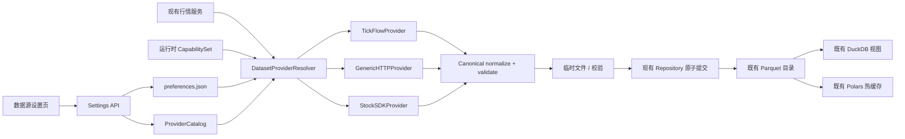

# one-trading 数据源 Provider / 插件基础层设计

- 状态：已完成内部评审，待用户确认
- 日期：2026-07-13
- 主项目：`/Users/simon/Trading/one-trading`
- 决策：定向同步上游 Provider / 插件能力，并在接入前补齐兼容层与存储护栏

## 1. 背景与版本基线

one-trading 当前几乎全部行情能力由 TickFlow 提供。项目已存在
`MarketDataProvider` 协议和 Provider registry，但实际 registry 只注册
TickFlow；自定义扩展数据通过 `ext_data` 旁路进入，不参与核心行情路由。

本次只读审计确认的版本如下：

| 对象 | 版本 / 提交 | 结论 |
| --- | --- | --- |
| one-trading 本地 HEAD | `d4a834e94270e3fb90eebad269fea1241da3c51f` | 当前本地开发基线 |
| 上游稳定标签 | `v0.1.84` / `33212a7d95fc0b28c35aed26ea1e7a250cfb3243` | Provider 持久化路径的参考基线 |
| 上游当前 main | `ede22336fa56b5a0f1be5e335be0cc8241b3d8e6` | 比 `v0.1.84` 多 18 个提交 |
| 本地与上游 main 差距 | 136 个提交 | 不适合整体 fast-forward |

上游 Provider 相关关键提交：

- `fa089818518ff979c3ef851ded9c9b8acf1cba28`：自定义 HTTP 数据源、设置页、服务分流和集中限频。
- `966d94ab0364f464cbca5904ff7a351eef64993b`：插件发现、安装控制面和 stock-sdk Provider。
- `9b22030166e12852348cf0aac244e666d8637273`：前端按数据集能力动态分流。
- `03e99bd05fdb5f266c5dc9e6c63a2d690ada491b`：stock-sdk 取数日志。
- `f273349cc8387b73b17172bb36b42e8a97327098`：Windows Node / UTF-8 bridge 修复。
- `f0a082b01a9c3ca03846fad866edff3a5f002b4f`：数据获取耗时诊断日志。
- `a05927baf2f7c246545f28708787786946ab90b6`：Parquet 原子写入和分区锁。
- `6bb6eadb123bc9eacce5d52b6e26bbcf26f908a8`：Parquet schema 演进兼容。
- `697ff2a181686dae6e15807b8e6a35c5ae20f3fb`：研究用途边界和插件默认关闭策略。

本设计不把“最新版”理解为整仓照搬。Provider 主链以 `v0.1.84` 的稳定
落盘行为为参考，选择性吸收当前 `main` 的合规、平台兼容和诊断改进，
同时修复审计发现的上游回归。

## 2. 目标

1. 保持 TickFlow 为默认主源，未配置其他 Provider 时行为完全不变。
2. 把 TickFlow、自定义 HTTP 和 stock-sdk 放入同一个可查询的 Provider catalog。
3. 建立 `dataset × asset_type` 能力矩阵；第一阶段仅允许 A 股股票切换外部 Provider。
4. 保持现有 API、Parquet 目录、DuckDB 视图、Polars 热缓存及用户数据兼容。
5. 扩展现有 `CapabilitySet`，使业务门控继续只依赖一个运行时能力对象，不直接读取 `tiers.yaml`。
6. 在接多源前补齐原子写入、分区并发锁和 schema 演进兼容。
7. 提供可审计的 Provider 选择、耗时、行数、失败与回退日志。
8. 为下一阶段接入 a-stock-data，以及引入 finshare / easy_tdx 式健康路由保留稳定接口。

## 3. 非目标

- 本阶段不整体同步上游 ETF、回测、策略、交易或其他产品功能。
- 本阶段不接入 a-stock-data 的实际数据端点。
- 本阶段不实现通用的多源自动切换、熔断、cooldown、健康探测或 best-host 持久化。
- 本阶段不把 go-stock 直接改造成 one-trading 的统一网关。
- 本阶段不改变现有业务表的主 schema，不在已有 Parquet 行内新增 `source` 列。
- 本阶段不在运行时自动安装 stock-sdk；安装必须由用户显式触发。
- 本阶段不承诺 stock-sdk 的真实网络链路进入默认验收门禁。
- 本阶段指数、ETF、instruments / universe 和 financial 继续固定使用 TickFlow。
- 本阶段自定义 / 插件 Provider 可选择 `daily`、`adj_factor`、`realtime`；
  `minute` 只有在 Provider 明确声明并通过 `1m` conformance 后才可选择。
- catalog 可以识别 `financial` 能力声明，但第一阶段不开放其偏好、业务路由或编辑 UI。

## 4. 必须保持的兼容契约

### 4.1 数据与存储

- 数据根目录继续由 `settings.data_dir` 决定，支持项目 `data/`、桌面同级
  `data/` 和 `DATA_DIR` 覆盖。
- 用户偏好继续保存到 `data/user_data/preferences.json`。
- 以下物理目录与现有文件命名保持不变：
  `kline_daily`、`kline_daily_enriched`、`kline_minute`、`adj_factor`、
  `financials`、`instruments`、指数 / ETF 对应目录和扩展数据目录。
- 日 K 主存储列保持
  `symbol,date,open,high,low,close,volume,amount`。
- DuckDB 既有视图名和 Polars 缓存刷新入口保持不变。
- 多源写入必须先通过 canonical schema 校验，再进入现有 Repository。

### 4.2 API 与前端

- 现有 `/api/kline`、`/api/data`、`/api/financials` 等接口不改路径和响应主结构。
- 数据源控制面只新增 `/api/settings/data-sources*`、插件安装状态和
  `/api/settings/preferences/data-providers`。
- 现有 one-trading 品牌、Logo、AI / Codex CLI、桌面打包名和启动脚本不被上游覆盖。
- `Layout.tsx` 只手工并入数据源状态入口，不整体替换本地导航。

### 4.3 能力门控

- `CapabilitySet` 继续是业务层唯一的运行时能力真理源，并扩展
  `effective_datasets: dict[(dataset, asset_type), DatasetCapability]`。
- `tiers.yaml` 仍只参与 TickFlow policy 探测或默认策略，不被业务服务直接读取。
- `has(Cap)` / `require(Cap)` 保持 TickFlow 专属能力语义；行情数据路由使用
  `has_dataset(dataset, asset_type)` / `require_dataset(dataset, asset_type)`。
- Provider 数据集能力与 TickFlow 探测能力在 `CapabilitySet` 构建或刷新时合成，
  不把自定义源错误地绑定到 TickFlow 商业档位。
- `/api/capabilities` 在保留原响应字段的同时新增 `effective_datasets`；前端凡是
  控制 daily / adj / minute / realtime 可用性的地方，统一读取该字段。

## 5. 方案选择

### 5.1 未采用：整体升级到上游 main

优点是上游一致性最高；缺点是会同时引入 136 个提交，并与本地品牌、AI、
依赖锁、打包文件和前端导航发生大面积冲突。上游 main 当前还包含自定义分钟 K
不落盘回归，因此本次不采用。

### 5.2 未采用：原样复制上游 Provider 目录

上游并没有真正统一 registry：TickFlow 仍在 `data_providers/registry.py`，
自定义源和插件则使用 loader 内另一套 `_PROVIDERS`。只复制目录会造成控制面、
服务路由和实际取数不一致，也不利于后续接 a-stock-data。

### 5.3 采用：定向同步 + 兼容层加固

选择性移植上游经过验证的 Provider、插件、设置 API 和 UI；先补存储护栏，
再增加一个薄的统一 catalog 与按数据集解析层。第一阶段只提供确定性选择和
受控回退，不提前实现完整韧性路由。

## 6. 目标架构



### 6.1 ProviderCatalog

新增 `ProviderRuntime`，内部只暴露一个带 generation 的不可变 snapshot：

```python
@dataclass(frozen=True)
class ProviderRuntimeSnapshot:
    generation: int
    descriptors: Mapping[str, ProviderDescriptor]
    factories: Mapping[str, ProviderFactory]
    selections: Mapping[DatasetKey, str]
    effective_datasets: Mapping[DatasetKey, DatasetCapability]
```

catalog 是该 snapshot 的 descriptors / factories 部分，负责：

- 注册 TickFlow、内置但默认关闭的 stock-sdk，以及用户自定义 HTTP Provider。
- 提供 `get(name)`、`list()`、`supports(name, dataset, asset_type)`、`status(name)`。
- `ProviderDescriptor` 至少包含名称、显示名、来源类型、
  `set[(dataset, asset_type)]`、限频、安装状态、启用状态和最近加载错误。
- catalog 只保存配置 / factory，不长期持有 HTTP client。每次 fetch 通过 context manager
  创建并关闭 Provider，避免 reload 关闭正在工作的旧 client 或泄漏连接。
- reload 或偏好更新先在锁外构建包含 catalog、selection 和 effective capabilities 的
  完整候选 snapshot；配置 / 偏好原子落盘成功后，用一个指针原子发布新 generation。
  失败保留旧运行态。读取方一次操作只持有一个 snapshot，不能分别读取三份状态。

stock-sdk 使用明确状态机：

| 状态 | 含义 |
| --- | --- |
| installed | 固定版本依赖和 integrity 校验通过 |
| available | bridge 自检成功 |
| enabled | `enabled_plugins` 偏好显式开启；默认 false |
| selected | 至少一个允许的数据集选择了该插件 |

安装不自动启用，启用不自动选择；禁用或卸载时所有相关偏好立即回退 TickFlow。
catalog 不负责自动 fallback，也不直接写盘。

### 6.2 DatasetProviderResolver

解析器输入为数据集、资产类型、用户偏好和运行时能力，输出确定的 Provider 与解析原因。

第一阶段支持矩阵如下：

| Provider | asset type | daily | adj factor | realtime | minute | financial | instruments |
| --- | --- | --- | --- | --- | --- | --- | --- |
| TickFlow | stock / index / ETF | 保持现状 | 保持现状 | 保持现状 | 保持现状 | 保持现状 | 保持现状 |
| custom HTTP | stock | 可选 | 可选 | 可选 | 仅 `1m` conformance 后可选 | 仅识别，不路由 | 不路由 |
| stock-sdk | stock | 可选 | 可选 | 可选 | 仅 `1m` conformance 后可选 | 不支持 | 不路由 |

指数、ETF、instruments / universe 和 financial 在第一阶段继续固定 TickFlow；这避免
把只支持 A 股股票的源误判为多资产 Provider，也避免使用未定义的 financial schema。

解析规则：

1. 读取该数据集的偏好；无偏好时使用 TickFlow。
2. Provider 不存在、未启用或未声明该 `dataset × asset_type` 时，受控回退 TickFlow并记录原因。
3. Provider 已选中但请求运行时失败或返回空数据时，本阶段不静默换源。
4. 失败必须保留既有 Parquet，不得以空结果覆盖旧分区。
5. 解析结果携带 Provider 名称、数据集和能力限制，供服务与日志使用。

第 3 点刻意留给下一阶段的 router / cooldown / circuit breaker，避免当前阶段把
“配置回退”和“运行时容灾”混成一套不透明行为。

### 6.3 运行时能力合成

扩展现有 `CapabilitySet`，而不是在业务层引入第二套真理源：

- 原 `_caps: dict[Cap, CapabilityLimits]` 保留，继续表达 TickFlow / 深度 / WebSocket 等能力。
- `CapabilitySet` 持有稳定的 `ProviderRuntime` 引用；dataset 方法从其当前单一 snapshot
  读取，不在自身复制第二份 effective map。
- 新增 `has_dataset()`、`limits_for_dataset()` 和 `resolve_dataset()`；服务用
  `resolve_dataset()` 一次取得同 generation 的 provider factory、selection、limits 和 reason，
  不采用“先检查 capability、再重新读取 resolver”的两次读取模式。
- startup 在 catalog 加载后发布 generation 1；保存偏好、reload、启用 / 禁用插件时，
  先构建完整候选、原子写配置 / 偏好，再一次发布新 generation。
- 选中 TickFlow 时，有效能力必须映射回原 `Cap`；选中外部 Provider 时由
  `dataset × asset_type` 声明、启用状态和配置有效性决定。
- `/api/capabilities` 增量返回 `effective_datasets`。现有字段不删除。

实施前先用 characterization tests 枚举后端所有 `capset.has/require` 和前端所有
capability 消费点。`api/kline.py`、分钟同步配置、实时行情入口和数据源页面必须改读
effective dataset；financial、index、ETF 和 depth 仍按原 TickFlow Cap。业务代码继续
不读取 `tiers.yaml`。

### 6.4 Canonical schema 与协议

Provider 统一为一个 fetch 协议，避免现有实现的方法签名和返回类型继续漂移：

```python
@dataclass(frozen=True)
class ProviderRequest:
    dataset: Dataset
    asset_type: AssetType
    symbols: tuple[str, ...] = ()
    start_time: datetime | None = None
    end_time: datetime | None = None
    frequency: Literal["1m"] | None = None
    on_progress: Callable[[int, int], None] | None = None

@dataclass(frozen=True)
class ProviderResult:
    frame: pl.DataFrame
    provider: str
    dataset: Dataset
    asset_type: AssetType
    frequency: str | None
    request_id: str

class MarketDataProvider(Protocol):
    def fetch(self, request: ProviderRequest) -> ProviderResult: ...
    def close(self) -> None: ...
```

第一阶段 transport canonical schema：

- `daily`：必需 `symbol,date,open,high,low,close,volume,amount`；允许
  `pre_close,change_pct` 作为可选 transport 列。
- `adj_factor`：`symbol,trade_date,ex_factor`。
- `minute`：必需 `symbol,datetime,open,high,low,close,volume,amount`；
  `ProviderResult.frequency` 必须为 `1m`。
- `realtime`：必需 `symbol,last_price,prev_close,open,high,low,volume`，允许
  `amount,quote_ts` 等可选列；统一返回 DataFrame，不再有 list / DataFrame 双形态。
- `financial` 和 `instruments` 协议留到对应路由开放前单独定义，本阶段不伪造通用 schema。

`StorageProjector` 负责从 transport frame 投影到现有物理 schema；日 K 物理层仍为
8 列，来源等元数据只放在 `ProviderResult` / manifest。`data_providers/schemas.py`
成为 schema 唯一真理源，删除 `kline_sync.py`、normalizer 和插件中的重复常量，并用
golden tests 固定 transport / physical 两层边界。

### 6.5 存储护栏与来源追踪

在任何新 Provider 写入前引入共享 `PartitionWriter`，并盘点所有行情相关
`write_parquet()` 调用。daily、adj、minute、realtime flush、financial 和 instruments 的
现有写路径都必须通过同一个 helper，即使后两者本阶段仍固定 TickFlow。

`PartitionWriter` 契约：

- 每个目标路径使用跨进程文件锁和进程内 path lock。
- 临时文件使用同目录唯一名称，不复用固定 `part.parquet.tmp`。
- 写完文件后 flush / fsync，使用 `os.replace` 原子替换，再 fsync 父目录。
- 新旧分区扫描使用 schema 兼容 helper 和 `union_by_name`。
- 写前校验必需列、类型、日期范围、symbol 格式、重复键、frequency 和最大行数。
- 空结果或校验失败不创建 pending transaction，也不触碰最终文件。

外部 Provider 写入使用两阶段 manifest：

1. 在 `data/provider_transactions/<run_id>/` 原子写入 `pending.json`。
2. 每次覆盖前保存该分区 preimage；同卷优先硬链接，不支持时复制，并记录不存在标记。
3. 每个目标分区严格执行 write-ahead 顺序：
   - 在持有 path lock 时保存并 fsync preimage，计算 pre-checksum。
   - 在同目录写完 postimage 临时文件，fsync 并计算 expected post-checksum。
   - 把 target、preimage、pre-checksum、expected post-checksum、主键范围和
     `state=planned` 原子写入 pending 并 fsync。
   - 执行 `os.replace` 和父目录 fsync。
   - 把该 target 更新为 `state=applied`、写后行数和实际 post-checksum，再次原子写 pending 并 fsync。
4. 全部成功后原子生成不可变 `committed.json`，再写入
   `data/provider_lineage/<dataset>/<run_id>.json`。
5. 启动时扫描 transaction 和 lineage，并按恢复矩阵处理。

恢复矩阵：

| 状态 | 启动恢复行为 |
| --- | --- |
| pending target=planned，当前等于 pre-checksum | 视为尚未替换，清理 postimage 临时文件 |
| pending target=planned，当前等于 expected post-checksum | 视为 replace 后崩溃，按 preimage 回滚 |
| pending target=applied | 校验当前 post-checksum 后按 preimage 回滚 |
| preimage 标记为不存在，target=planned 且当前仍不存在 | 清理 postimage 临时文件，保持目标不存在 |
| preimage 标记为不存在，当前等于 expected post-checksum | 删除本次新建目标并 fsync 父目录；planned / applied 行为一致 |
| preimage 标记为不存在，当前为其他内容 | 隔离并报警，不删除未知数据 |
| pending 中当前 checksum 既不等于 pre 也不等于 post | 隔离并报警，不自动覆盖 |
| committed 存在、lineage 缺失 | 校验当前分区等于 postimage checksum；一致则重建 lineage，不回滚 |
| committed 与当前分区 checksum 不一致 | 隔离事务并报警，不自动覆盖当前数据 |
| 显式 undo | 仅当当前分区仍等于该事务 postimage 时应用 preimage，否则拒绝并报警 |

lineage 的语义明确为“写入事件”，不是逐行真实来源。一个分区发生混合 upsert 后，
现有统一视图的 `source` 只保留为历史兼容字段，明确不作为真实 provenance，也不依据
manifest 改写。真实来源状态只通过状态 / 审计 API 按目标分区返回 `last_writer`、
`mixed_or_unknown`、run 和 checksum。前端不得把统一视图的兼容 `source` 字段显示为
数据血缘。本阶段不做逐行 JOIN，也不在主表增加 `source`。

preimage 按每个目标分区保留其最近一次成功外部写入，并保留所有未完成 / 隔离事务；
清理由显式 retention job 执行，不能在 committed 和 lineage 都完成前删除。代码回滚和
数据回滚分开处理。

### 6.6 特权控制面

插件安装 / 卸载 / 启用、自定义源 CRUD / reload / test、详细配置读取均视为管理员能力：

- 若尚未设置访问密码，即使来自本机或内网也返回 403；不能沿用全局中间件的本地放行。
- 设置密码后必须具有有效管理员 session。
- 所有状态修改请求必须通过 exact-origin 校验和 session-bound CSRF token。
- public list 只返回显示名、状态和 datasets；详细配置 DTO 必须脱敏，不返回 token 值。
- 增加未初始化、未登录、跨 Origin、CSRF 失败和有效管理员五组 API 测试。

这条边界是 SSRF 和插件供应链防护的第一层，不能仅依赖 URL 黑名单或“本机使用”假设。

### 6.7 自定义 HTTP 数据源

移植并收紧上游 YAML 配置、HTTP client、响应 path 和字段映射能力：

- 支持 GET / POST、header / bearer / query token、批量和 rpm 限制。
- token 只允许环境变量引用，不回传明文，不写日志。
- source id 必须匹配安全字符白名单；配置路径使用 resolve 后的固定父目录检查，并拒绝
  `..`、绝对路径和 symlink 逃逸。
- URL 禁止 userinfo，只允许 `http` / `https` 和受控端口；解析并检查全部 A / AAAA。
- 默认拒绝 private、loopback、link-local、metadata、unspecified、multicast、reserved、
  IPv6 ULA；连接必须使用已验证的解析结果，不能校验后再次独立解析主机。
- 默认关闭 redirects；若以后开放，必须逐跳重新执行完整 URL / DNS 校验。
- HTTP client 使用 `trust_env=False`，不继承系统代理；发送 `Accept-Encoding: identity`，
  限制 connect / read / total timeout、响应体字节数、解析后行数和嵌套深度。
- 测试接口只取数和归一化，不写盘。
- 配置文件使用写临时文件后原子替换；非法 YAML 只进入 errors，不影响应用启动。
- 第一阶段前端展示 daily、adj_factor、realtime；minute 只有声明 `1m` 且 conformance
  通过才出现。financial 只在原始描述中标为“未开放路由”，不允许选择。

人工 QA 的 loopback 只通过测试 app factory 注入的 policy 开放；该 factory 强制临时
`DATA_DIR`、后端绑定 `127.0.0.1` 且环境为 QA，生产 app 不读取普通环境开关来放宽规则。

### 6.8 stock-sdk 插件

- 插件代码放在 `backend/app/plugins/stocksdk/`。
- `plugin.yaml` 明确研究用途、第三方来源、Node 版本和默认关闭。
- 未安装依赖时只展示不可用状态，不阻塞启动。
- 安装和卸载必须经过登录保护、插件白名单和固定目录，不接受任意包名。
- 固定 stock-sdk 精确版本和 lockfile integrity；依赖先安装到 staging，自检成功后原子启用。
- 安装过程禁止 shell 和任意包名，固定 cwd，清洗继承环境，不向 Node 传递 TickFlow、
  AI、HTTP token 或代理凭证。
- 子进程限制总超时和输出大小；超时终止整个进程树。安装使用全局锁并拒绝路径 / symlink 逃逸。
- 安装失败或完整性校验失败保留旧版本和 disabled 状态。
- 默认验收用 fake bridge 覆盖协议、归一化和错误处理，不自动联网安装 npm 依赖。
- 分钟数据调用必须显式传入 `1m`，若插件无法保证则该数据集标记 unavailable。
- 桌面冻结包未验证 Node 资源收集前，stock-sdk 标为开发 / Docker 可选能力。

### 6.9 设置 API 与前端

新增能力：

- 列出 builtin / plugin / custom 数据源及加载错误。
- 新增、读取、更新、删除、reload 和试拉自定义源。
- 显式安装 / 卸载白名单插件。
- 保存第一阶段开放数据集的 Provider 偏好。
- 删除 / 禁用 Provider 时仍清理所有已知偏好键，包括上游遗漏的
  `minute_data_provider` 和未来预留键，防止同名重建后静默复活。

前端数据源页按 Provider 实际 `dataset × asset_type`、enabled 和 conformance 状态显示
可选项；不会把插件没声明或本阶段未开放的能力显示为可选择。侧栏只加入紧凑状态入口，
保持 one-trading 现有品牌和信息密度。

## 7. 上游已知问题及本项目处理

| 上游问题 | 本项目处理 |
| --- | --- |
| TickFlow 与 custom / plugin 使用两套 registry | 引入统一 ProviderCatalog |
| main 的 custom 分钟分段回调未落盘 | 不照搬该路径；以回归测试固定 1m 落盘 |
| stock-sdk 默认 `5m`，现有表按 `1m` 假设 | 强制 `freq=1m`，不满足则禁用 minute |
| 删除自定义源遗漏 minute 偏好 | 删除 / 禁用时清理所有已知偏好，并测试同名重建不会复活 |
| financial Provider 协议和物理 schema 未定义 | 第一阶段固定 TickFlow，不开放外部 financial 路由 |
| builtin capabilities 使用手写固定数组 | API 从 catalog 的 `dataset × asset_type` 描述生成 |
| 运行时异常 / 空结果没有通用 fallback | 本阶段显式报错且保留旧数据；下一阶段实现 router |
| normalizer 丢失 source，统一视图硬编码 TickFlow | 视图字段仅作历史兼容；真实来源只由 manifest 审计 API 表达 |
| reload 无锁且可能关闭 in-flight client | catalog 存 factory；每次 fetch 独立 client；snapshot 原子交换 |
| 自定义 URL / 动态插件存在信任边界 | 特权管理员端点、SSRF policy、供应链锁定和日志脱敏 |

## 8. 预期改动边界

### 8.1 后端核心

- `backend/app/data_providers/`
- `backend/app/plugins/stocksdk/`
- `backend/app/tickflow/capabilities.py`
- `backend/app/parquet.py` 及新增共享 PartitionWriter / transaction 模块
- `backend/app/services/preferences.py`
- `backend/app/services/kline_sync.py`
- `backend/app/services/quote_service.py`
- `backend/app/services/financial_sync.py`（仅统一既有写盘，不切源）
- `backend/app/services/instrument_sync.py`（仅统一既有写盘，不切源）
- `backend/app/services/extend_history.py`
- `backend/app/jobs/daily_pipeline.py`
- `backend/app/api/settings.py`
- `backend/app/api/kline.py` 与 capability response 入口
- `backend/app/api/auth.py`、`backend/app/services/auth.py`（管理员 / CSRF 边界）
- `backend/app/main.py`
- `backend/app/tickflow/repository.py`
- 新增 schema、catalog、resolver、URL policy、manifest / recovery 支撑模块和对应测试。

### 8.2 前端

- 新增 `frontend/src/pages/settings/DataSources.tsx`
- 新增 `frontend/src/pages/settings/DataSourceEditor.tsx`
- 定向修改 `Settings.tsx`、`api.ts`、`queryKeys.ts`、`Layout.tsx` 和 `Data.tsx`
- 定向修改消费 minute / realtime effective capability 的组件或 hook。
- 引入最小前端测试配置，只覆盖本轮新增数据源页面与交互。

### 8.3 明确不整体覆盖

- `backend/pyproject.toml`、`backend/uv.lock`、`frontend/package.json` 只合并必要依赖，
  保留 one-trading 包名并重新生成 lock。
- `Layout.tsx`、`main.py` 手工合并。
- `ai_provider.py`、`desktop.py`、Onboarding、打包脚本和品牌文件不从上游同步。

## 9. 错误处理与可观测性

每次 Provider 操作使用统一事件字段记录 INFO / WARNING 日志：

- `event=provider_fetch_started|provider_fetch_completed|provider_fetch_failed`
- `run_id`
- `provider`
- `dataset`
- `asset_type`
- `symbols_count`
- `rows`
- `elapsed_ms`
- `fallback_reason`

日志禁止包含 token、Authorization header、完整 secrets 和原始敏感 URL query。

错误分级：

- 配置加载错误：保留其他 Provider，状态 API 返回 errors。
- Provider 不存在 / 不支持数据集：回退 TickFlow并记录解析原因。
- Provider 运行失败：返回受控错误，保留旧数据，不静默切换。
- canonical 校验失败：拒绝写盘，记录字段和行数摘要，不打印凭证或完整原始响应。
- stock-sdk 未安装：Provider 状态 unavailable，应用继续启动。

## 10. TDD 与验收门槛

实现必须遵循先 RED、再最小 GREEN、最后重构的顺序。至少覆盖：

1. 自定义配置、映射、鉴权脱敏和非法配置。
2. SSRF 矩阵：IPv4 / IPv6 私网、全部 DNS 结果、userinfo、端口、redirect、proxy、
   超时、响应大小、路径和 symlink 逃逸。
3. HTTP Provider 的 GET / POST、空响应、超时、daily / adj / realtime canonical，
   以及 minute `1m` conformance。
4. stock-sdk bridge、归一化、平台编码、未安装 / disabled 状态、integrity 失败、
   安装失败回滚、环境变量清洗和子进程超时。
5. 特权设置 API 的未初始化、未登录、Origin、CSRF、CRUD、reload、test、插件白名单
   和全部已知偏好清理。
6. `CapabilitySet.effective_datasets`、A 股 asset boundary、daily / adj / realtime 路由，
   以及 minute 仅在 conformance 后开放；financial / index / ETF 保持 TickFlow。
7. 1 分钟数据落盘，禁止 5 分钟数据混入。
8. PartitionWriter 原子写、故障注入、跨进程争用、新旧 schema 扫描、pending 崩溃恢复、
   preimage 回滚和 committed checksum。
9. lineage 的 write-event 语义、恢复矩阵和审计 API；统一视图 `source` 不作为真实来源。
10. 日志字段齐全且不泄露 token、Authorization、代理凭证或插件子进程环境。
11. 数据源页面的资产 / datasets 动态显示、状态机、编辑、试拉、删除与失败状态。

正式 RED 测试前先加入 characterization fixtures，固定旧 Parquet 可读、DuckDB 视图名、
现有 API 主响应结构、TickFlow 默认路由及现有 capability 行为。

基线与门禁：

- 当前后端基线：19 个测试通过；实施计划必须记录精确命令和当时 Python / Node / pnpm 版本。
- 全量 Ruff 有大量既存问题，因此本阶段只把新增 / 修改文件的定向 Ruff 作为门禁。
- 前端当前没有测试框架；本阶段为新增页面引入最小 Vitest 配置。
- `tsc --noEmit` 与 Vite build 必须通过。
- `pnpm lint` 当前缺少 eslint；本阶段补齐与现有脚本匹配的 eslint 依赖，新增 / 修改文件
  不得引入 lint 错误，既存全仓问题单独报告。

## 11. 人工试用与日志闭环

人工 QA 必须使用唯一临时目录和端口，不触碰现有约 96 MB 的真实数据。QA 前后记录
真实 `DATA_DIR` 的文件数量、总字节数和现有 Parquet checksum 清单并比较：

1. 确认没有指向真实 `DATA_DIR` 的生产实例正在写盘；否则停止 QA 并重新选择验证时段。
2. 创建 `/tmp/one-trading-provider-qa-<run_id>/`，其中保存 data、配置、checksum 和日志。
3. mock、QA backend 和 Vite 都只绑定 `127.0.0.1`；Vite 显式使用
   `--host 127.0.0.1`，使用独立端口和专用测试认证密码。
4. backend 只接受该唯一 Vite Origin；启动后检查三个监听地址均为 loopback，任一出现
   `0.0.0.0` 或局域网地址都终止 QA。
5. 通过测试 app factory 注入 loopback URL policy，生产 app 的默认 policy 保持不变。
6. 在 Codex 内置浏览器打开数据源设置页，完成登录、reload、试拉 daily、选择 mock
   Provider并执行一次日 K 同步。
7. 验证既有 API 能读到数据、Parquet 目录结构未改变、pending 已转 committed、
   checksum 与 write-event lineage 一致。
8. 停止 mock server 后再次试拉，确认受控错误、无静默 fallback 且旧 Parquet 保持可读。
9. 加载非法 YAML，确认 errors 可见且 `/health` 正常；验证未安装 stock-sdk 不阻塞启动。
10. 保存并读取 backend、frontend dev server、mock、浏览器 console 和 network 记录，检查
   ERROR、Traceback、异常时序、耗时、回退原因、凭证泄露和埋点缺失。
11. QA 结束后复核真实数据 checksum 清单完全一致。

只有自动测试、人工主路径、至少一条失败路径及日志分析全部通过后，才可以汇报
“已完成”或“已修复”。

## 12. 备份、实施与回滚

实施前在 `/Users/simon/备份/codex` 下创建新的时间戳子目录，备份：

- `/Users/simon/Trading/one-trading`
- 本地未提交 diff、未跟踪文件清单和当前提交信息

备份目录内附带 `README【codex】.md`，记录备份原因、全部原路径和时间。

代码实施使用隔离工作区或等价的可回放补丁方式，避免污染当前含用户改动的工作树。
每个阶段只合并该阶段文件；不恢复、不覆盖用户已有的品牌、AI、打包或配置改动。

回滚顺序：

1. Provider 偏好全部重置为 TickFlow。
2. 禁用自定义源和 stock-sdk，应用仍使用原有 TickFlow 路径。
3. 对未完成 provider transaction 由启动恢复逻辑应用 preimage；已提交事务只能通过其
   undo manifest 显式回滚，不能用代码回滚替代数据回滚。
4. 回滚新增控制面代码时保留既有 Parquet、manifest 和用户数据。
5. 若代码或配置整体验证失败，从实施前备份恢复代码文件；恢复数据前必须再次确认
   目标分区和 checksum，不能覆盖实施后新增的真实行情数据。

## 13. 分阶段落地顺序

1. Characterization tests、备份和所有行情写盘点清单。
2. 共享 PartitionWriter、schema compatibility、transaction / recovery；此时仍只走 TickFlow。
3. TickFlow-only ProviderCatalog、resolver 和扩展 CapabilitySet，验证默认路径完全等价。
4. 特权控制面和 custom HTTP，先开放 daily / adj / realtime，再开放通过 conformance 的 minute。
5. stock-sdk 安装状态机和 fake bridge；feature flag 默认关闭。
6. 数据源设置 UI、Codex 内置浏览器人工主路径、失败路径和日志闭环。

每一阶段独立 RED / GREEN、独立回滚检查；上一阶段门禁未通过时不进入下一阶段。

## 14. 后续阶段

本设计验收后再依次进行：

1. 把 a-stock-data 接为正式 Provider，优先补资金流、筹码、人气和 TickFlow 缺口字段。
2. 参考 finshare / adata 建立按端点健康、cooldown、熔断和动态 fallback router。
3. 参考 easy_tdx 增加 host 池探测与 best-host 持久化。
4. go-stock 继续作为 API 地图和产品能力参考，不承担统一网关职责。
5. 将 source lineage 逐步升级为可查询的数据质量与来源审计界面。
